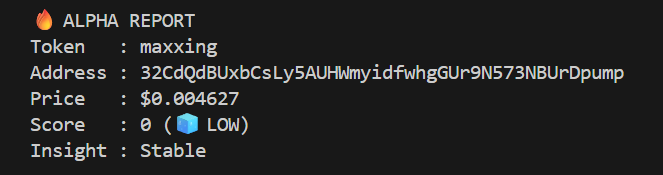

# 🚀 Solana Alpha Radar (Birdeye BIP Sprint 3)

[English](#english) | [Bahasa Indonesia](#bahasa-indonesia)

---

## English

### 📝 Description
**Solana Alpha Radar** is a lightweight terminal-based monitoring tool built for the Solana ecosystem. It identifies high-momentum tokens by integrating Birdeye’s trending data with real-time pricing and security insights.

This project was developed as part of the **Birdeye Data 4-Week BIP Competition (Sprint 3)**.

---

### 💡 Why This Matters
In fast-moving on-chain markets like Solana, traders often miss early opportunities due to lack of real-time insights.

Solana Alpha Radar bridges this gap by combining:
- Trending momentum signals
- Real-time price tracking
- Basic security analysis

This enables faster and more informed decision-making.

---

### ✨ Features
- 🔥 **Top 5 Trending Tracker** — Automatically fetches trending tokens
- 💰 **Real-Time Price** — Displays latest market price
- 🛡️ **Security Check** — Detects mintable tokens & ownership
- ⚠️ **Risk Indicator** — Warns about potential risky tokens

---

### 🛠️ Tech Stack
- Python
- Birdeye API
- Requests
- Python-dotenv

---

### 📊 Birdeye Endpoints Used
- `/defi/token_trending` → Identify trending tokens
- `/defi/price` → Retrieve real-time prices
- `/defi/token_security` → Analyze token risks

---

### 📸 Example Output



---

### 🧪 Sample Output

```text
Memeriksa: swarms (...)
Harga: $0.031650
Mintable: Tidak
Owner: 7gHk9sK2...
